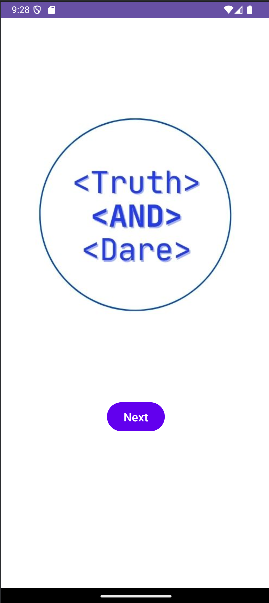

# 🎉 Truth and Dare Android App

An interactive and fun party game that brings the classic **Truth or Dare** experience to your Android device! This app features a spinning bottle mechanic, random truth and dare challenges, and a clean, responsive UI to keep the game engaging and lively.

---

## 📱 Features

- 🌀 **Spin the Bottle**: Realistic spinning animation to choose the next player.
- ❓ **Truth Questions**: Get asked funny, deep, or daring truth questions.
- 💥 **Dare Challenges**: Perform creative and fun dares selected at random.
- 🔁 **Replay Friendly**: Easily return to the main screen and keep the game going.
- 🎨 **User-Friendly UI**: Clean and intuitive interface with responsive layouts.
- ⚡ **Smooth Animations**: Adds a playful and engaging feel to every round.

---

## 🧩 Gameplay Flow

1. **Launch the App** → Start screen with a "Start" button.
2. **Spin the Bottle** → A spinning bottle randomly selects a player.
3. **Truth or Dare?** → The chosen player picks their challenge type.
4. **Receive Challenge** → App displays a random truth or dare.
5. **Repeat!** → Return to spin screen and continue the game.

---

## 📸 Demo Video

(screenshots/video1.mp4)

> 🎬 Click the image to watch the full gameplay demo.

---

## 🛠️ Tech Stack

- **Language**: Java  
- **IDE**: Android Studio  
- **UI Layouts**: XML (`RelativeLayout`, `LinearLayout`)  
- **Animations**: Bottle spin via `RotateAnimation`  
- **Activities**:
  - `MainActivity`: Launch screen
  - `SpinTheBottleActivity`: Bottle spin mechanism
  - `TruthActivity`: Displays a random truth
  - `DareActivity`: Displays a random dare

---

## 📦 Installation

1. Clone the repository:
   ```bash
   git clone https://github.com/mycode05/TruthAndDareApp.git
